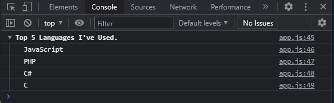

Console is a web tool for developers to debug their code. It is used to display information about the code, such as the values of variables, the results of expressions, and the results of function calls. It is also used to display errors and warnings.

Console is a global object so it is available in every scope. It is also available in the global scope of the browser window.

# Javascript Console **Methods**

Javascript console object has multiple methods which give you the ability to log out objects in different ways and to get other related information.

Console in javascript has more than 5 methods. Among all console methods, the log method is the most commonly used.

## 1. The warn method ❗

If you are working with developer tools or API’s, console.warn() is really useful to warn users that something might not be correct.
This is commonly used by the NPM packages to let developers know if the API/version is deprecated or about any future changes to the library. Some browsers add a small exclamation mark ⚠️ in the console log for warnings.
Here is an example:

```Javascript
console.warn("Please get vaccinated 😉");
```

Output:


## 2. The error method ¯\ \_(ツ)\_/¯

The method console.error() allows us to print error messages in the console. It takes the error message as one single argument. This method is often used for testing purposes.
Here is an example:

```Javascript
 console.error("its 2021 and we still can't download food 😪");
```

Output:


## 3. The table method 🧮

console.table() is used to display data in form of a table.
The method takes 1 mandatory argument data, which must be an array or an object.
Each element in the array becomes a row in the table.

The first column of the table is labeled as an index. For objects index will be property name and for array index are the actual index of array elements.Have a look at the example below:

```JavaScript
console.table([
    {
      Name: "George",
      Experiance: "6yrs",
      Mobile: "❎",
      Web: "✅",
    },
    {
      Name: "Leeroy",
      Experiance: "3yrs",
      Mobile: "✅",
      Web: "❎",
      Status: "Available",
    },
    {
      Name: "Aisha",
      Experiance: "2yrs",
      Mobile: "✅",
      Web: "✅",
    },
  ]);
```

Output:


## 4. The group method 👨‍👩‍👧‍👦

console.group() allows us to group the console statements. To end the grouping or console statements console.groupEnd() method is used.
It is optional to pass the parameter to the console.group(). You should still do it in order to clarify what values are being grouped together. The parameter passed will be displayed as a label for the group.
console.groupEnd() does not require any parameter, as it will always close the most recently created group.

```JavaScript
const label = "Top 5 Languages I've Used.";
  console.group(label);
  console.info("JavaScript");
  console.info("PHP");
  console.info("C#");
  console.info("C");
  console.groupEnd(label);
```

Output:



## 5. The custom log Method 🧬

To add CSS styling to the console output, we use the CSS format specifier %c. Then we start the console message, which is usually a String with the specifier followed by the message we intend to log, and, finally, the styles we want to apply to the message:

```JavaScript
  const spacing = "10px";

  const styles = `padding: ${spacing};
                  background-color: grey;
                  color: white;
                  font-style: italic;
                  border: 5px solid tomato;
                  font-size: 2em;`;

  console.log("%cThis was Fun, don't forget to subscribe", styles);
```

Output:


Here, we have used the %c format specifier to declare
that we’ll be applying CSS styles to the console output,
we have written a String we’d like to print to the console,
and finally we have defined the CSS effect we’d like to
apply to the String. If we check the console now,
we should get the String printed inside an awesome box.

# Conclusion

There we have it, a bit of a deeper look into the console object and some of the other methods that come with it. These methods are great tools to have available when you need to debug code.

Printing to the console is a great way to visualize data. I have seen most of the developers use only console.log() while developing or debugging. Most of the time, there are other console methods which — if used — can simplify logging.
I hope these methods will help you in debugging complex solutions with ease. If you have any questions or suggestions please don't hesitate to inbox me on Twitter.
