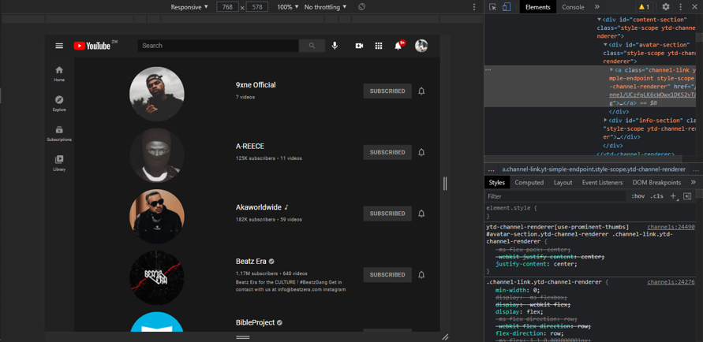
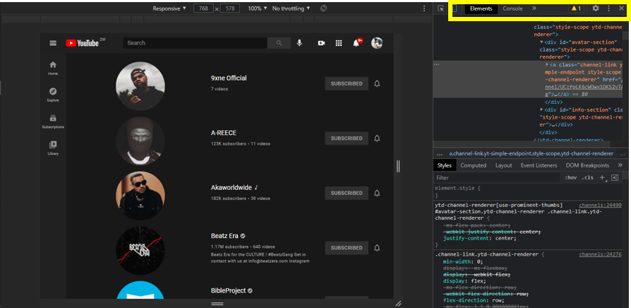
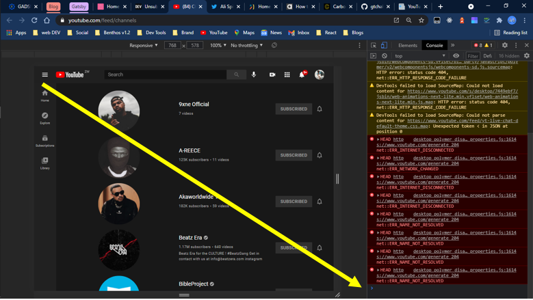

> I have a lot of tutorial channels i subscribed to that i never use. I was actually laughing the other day when I got a notification on youtube on a new C tutorial hahaha. Who is using C programming these days lol.

For almost a year I have been procrastinating on unSubscribing to these channels I never use. I mean the whole process of removing channel by channel just drains your energy. Luckly i manage to find a simple Hack that can remove all channels at once, "Life Saver Right".

---

## The Procedure.


Bulk unsubscribing from YouTube requires you to run a script, but don’t worry, this method was tried, tested, and verified. Plus, you don’t need to install any potentially harmful third-party program on your computer.  
Firstly you want to start by visiting this page on Youtube [Click Me](https://www.youtube.com/feed/channels).

Another way would be to go to your Youtube Tab and click Subscriptions followed by the manage button.

After these steps you need to right click on an empty space then click inspect Element. This should take you directly to Developer Tools, you should be seeing something like this :



---

## Step 2 - The Scripting Part

The next step is the crucial step. We now have to copy and paste the code below. Don't worry about the Code, i will do a break-down article of it next week. We now have to paste the code in our Console. Just click the console tab , im not sure where on your screen it will apper on but it should be like this



This should be the next screen you'll See



Now lets copy the code and paste it in our console. Paste it where you see the blinking cursor. After pasting it press Enter and see the Magic as the code removes channel by channel.

<div>
<div className="code-src" >
  browser page console
  <div className="js code-lang">JS</div>
</div>

```js
function youtubeUnsubscriber() {
  var count = document.querySelectorAll(
    "ytd-channel-renderer:not(.ytd-item-section-renderer)"
  ).length
  var randomDelay = 500

  if (count == 0) return false

  function unsubscribeVisible(randomDelay) {
    if (count == 0) {
      window.scrollTo(0, document.body.scrollHeight)
      setTimeout(function () {
        youtubeUnsubscriber()
      }, 10000)
    }

    unsubscribeButton = document.querySelector(".ytd-subscribe-button-renderer")
    unsubscribeButton.click()

    setTimeout(function () {
      document.getElementById("confirm-button").click()
      count--
      console.log("Remaining: ", count)

      setTimeout(function () {
        unsubscribedElement = document.querySelector("ytd-channel-renderer")
        unsubscribedElement.parentNode.removeChild(unsubscribedElement)
        unsubscribeVisible(randomDelay)
      }, randomDelay)
    }, randomDelay)
  }

  unsubscribeVisible(randomDelay)
}

youtubeUnsubscriber()
```

</div>

---

# Final Thoughts

I hope this article was useful , The next step is to break down the this article so stay tuned.
